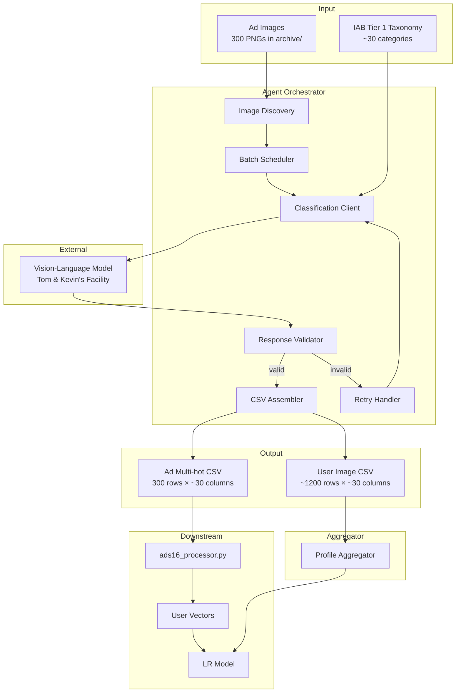
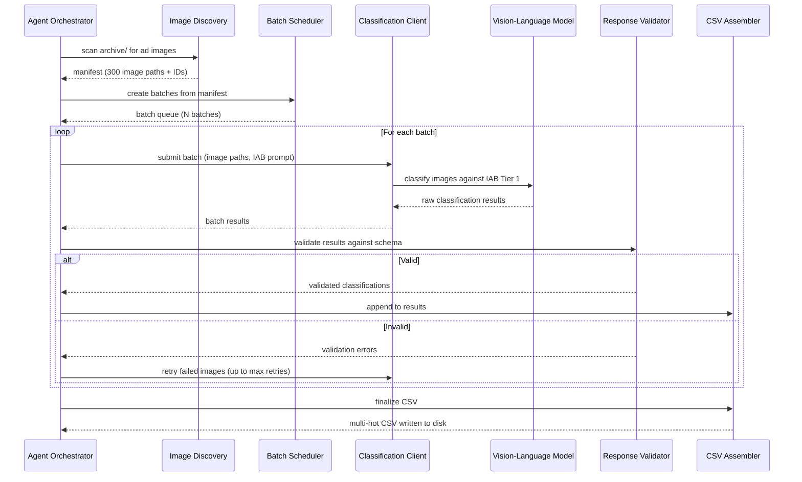
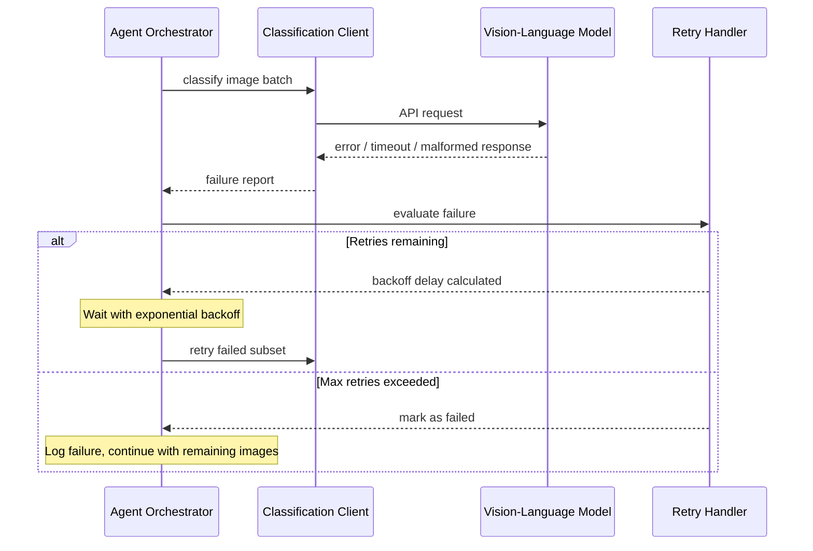

# Design Document: Agentic Image Classification Pipeline

## Overview

This feature implements an autonomous agent-driven pipeline that classifies the 300 ad images in the ADS-16 benchmark dataset into IAB Content Taxonomy Tier 1 categories. The pipeline produces a multi-hot CSV file where each row represents one ad image and each column represents one of the ~30 IAB Tier 1 categories. This CSV is the missing input that `ads16_processor.py` needs to compute weighted user profile vectors for the downstream Logistic Regression model.

The "agentic" aspect means the pipeline orchestrates the entire batch autonomously — submitting images to a vision-language model, handling rate limits and retries, validating classification outputs against the IAB schema, and assembling the final structured CSV. The agent uses Tom Overman and Kevin Mueller's batch processing facility as the classification backend.

Additionally, the pipeline classifies each user's 10 personal images (5 positive, 5 negative from the Corpus) into the same IAB space, producing per-user `pos_profile` and `neg_profile` vectors. These are aggregated IAB category vectors representing what each user likes and dislikes, providing additional features for the LR model without requiring contrastive learning methods.

## Architecture



## Sequence Diagrams

### Main Classification Flow



### Retry and Error Recovery Flow



## Components and Interfaces

### Component 1: Image Discovery

**Purpose**: Scans the ADS-16 archive directory structure and produces a manifest of all ad images (300) and personal user images (~1,200) with their canonical IDs.

**Interface**:
```
ImageManifest:
  ad_entries: List of ImageEntry       # 300 ad images
  user_entries: List of UserImageEntry  # ~1200 personal images
  total_count: int

ImageEntry:
  image_id: string        # e.g. "Cat0_1" matching ads16_processor convention
  category_index: int     # 0..19
  image_index: int        # 0..14 (within category)
  file_path: string       # relative path to PNG file

UserImageEntry:
  image_id: string        # e.g. "U0001_POS_1" or "U0001_NEG_3"
  user_id: string         # e.g. "U0001"
  sentiment: enum (positive, negative)
  image_index: int        # 0..4 (within pos/neg set)
  file_path: string       # relative path to PNG file
  label: string           # user-provided text description
```

**Responsibilities**:
- Walk the `archive/.../Ads/Ads/{1..20}/` directory tree for ad images
- Walk the `archive/.../Corpus/Corpus/U*/U*-IM-POS/` and `U*-IM-NEG/` for personal images
- Parse `*-IM-POS.csv` and `*-IM-NEG.csv` to extract text labels
- Map folder numbers (1-based) to category indices (0-based)
- Produce stable, deterministic ordering matching `ads16_processor.py`'s `image_id_for` convention
- Validate that exactly 300 ad images are found (20 categories × 15 images)
- Validate that each user has 5 positive and 5 negative images

---

### Component 2: Batch Scheduler

**Purpose**: Splits the full image manifest into appropriately-sized batches for submission to the classification backend, respecting rate limits and payload constraints.

**Interface**:
```
BatchConfig:
  batch_size: int              # images per batch (default: 10)
  max_concurrent_batches: int  # parallel batch limit (default: 1)
  inter_batch_delay_ms: int    # delay between batches (default: 1000)

Batch:
  batch_id: string
  entries: List of ImageEntry
  status: enum (pending, in_progress, completed, failed)
```

**Responsibilities**:
- Partition the 300 images into batches of configurable size
- Track batch status through the processing lifecycle
- Support resumption from partial progress (checkpoint state)
- Respect rate limits of the classification backend

---

### Component 3: Classification Client

**Purpose**: Interfaces with Tom Overman and Kevin Mueller's vision-language model facility to classify images against the IAB Tier 1 taxonomy.

**Interface**:
```
ClassificationRequest:
  image_path: string
  image_id: string
  taxonomy: List of string    # the IAB Tier 1 category names
  prompt_template: string     # classification instruction

ClassificationResponse:
  image_id: string
  categories: List of string  # matched IAB categories
  confidence_scores: Map of string to float  # category → confidence (optional)
  raw_response: string        # original model output for debugging
```

**Responsibilities**:
- Encode images for submission to the vision-language model
- Construct the classification prompt with the IAB taxonomy
- Parse structured responses from the model
- Handle API communication (timeouts, connection errors)

---

### Component 4: Response Validator

**Purpose**: Validates that classification responses conform to the expected schema and contain only valid IAB Tier 1 categories.

**Interface**:
```
ValidationResult:
  is_valid: boolean
  image_id: string
  validated_categories: List of string  # only valid IAB categories
  errors: List of string                # validation error messages
  warnings: List of string              # non-fatal issues
```

**Responsibilities**:
- Verify returned categories exist in the IAB Tier 1 taxonomy
- Reject responses with no categories (empty classification)
- Flag suspiciously high category counts (e.g., >5 categories for one image)
- Normalize category names (case, whitespace)
- Filter out hallucinated or invalid category names

---

### Component 5: Retry Handler

**Purpose**: Manages retry logic for failed classifications with exponential backoff and configurable limits.

**Interface**:
```
RetryPolicy:
  max_retries: int             # default: 3
  base_delay_ms: int           # default: 1000
  max_delay_ms: int            # default: 30000
  backoff_multiplier: float    # default: 2.0
  retryable_errors: List of string  # error types that warrant retry

RetryDecision:
  should_retry: boolean
  delay_ms: int
  attempt_number: int
  reason: string
```

**Responsibilities**:
- Track retry attempts per image
- Calculate exponential backoff delays
- Distinguish retryable errors (timeouts, rate limits) from permanent failures (invalid image)
- Provide circuit-breaker behavior if failure rate exceeds threshold

---

### Component 6: CSV Assembler

**Purpose**: Collects validated classification results and produces the final multi-hot CSV file compatible with `ads16_processor.py`.

**Interface**:
```
AssemblerConfig:
  output_path: string          # path for the output CSV
  image_id_column: string      # default: "image_id"
  taxonomy_columns: List of string  # IAB Tier 1 category names (column headers)

AssemblyReport:
  total_images: int
  successfully_classified: int
  failed_images: List of string
  output_path: string
  column_count: int
```

**Responsibilities**:
- Maintain an accumulator of classification results
- Convert category lists to binary multi-hot vectors
- Write CSV with `image_id` column + one column per IAB Tier 1 category
- Ensure row ordering matches the canonical image ID scheme
- Report coverage statistics (how many images classified successfully)
- Validate output dimensions (300 rows × ~30 feature columns + 1 ID column)

---

### Component 7: Profile Aggregator

**Purpose**: Collapses per-image IAB classifications of personal user images into two summary vectors per user (`pos_profile` and `neg_profile`), representing the user's content preferences in IAB space.

**Interface**:
```
UserProfileVectors:
  user_id: string
  pos_profile: ndarray (shape: n_iab_categories,)  # sum of IAB vectors for positive images
  neg_profile: ndarray (shape: n_iab_categories,)  # sum of IAB vectors for negative images
  diff_profile: ndarray (shape: n_iab_categories,) # pos_profile - neg_profile

AggregatorOutput:
  profiles: List of UserProfileVectors
  output_path: string  # path to user_profiles.csv
```

**Responsibilities**:
- Group user image classifications by user_id and sentiment (pos/neg)
- Sum multi-hot vectors within each group: `pos_profile = sum(iab_vectors for positive images)`
- Compute `neg_profile` and optional `diff_profile = pos_profile - neg_profile`
- Output a CSV with columns: `user_id, pos_{category}, neg_{category}, diff_{category}` for each IAB category
- Handle users with missing images gracefully (zero vectors for missing data)

---

## Data Models

### IAB Content Taxonomy Tier 1

The fixed label space for classification. Approximately 30 categories:

```
IAB Tier 1 Categories (representative subset):
- Arts & Entertainment
- Automotive
- Business & Finance
- Careers
- Education
- Family & Parenting
- Food & Drink
- Health & Fitness
- Hobbies & Interests
- Home & Garden
- Law, Government & Politics
- News & Current Events
- Personal Finance
- Pets
- Real Estate
- Religion & Spirituality
- Science
- Shopping
- Sports
- Style & Fashion
- Technology & Computing
- Travel
- ... (full list from IAB specification)
```

**Validation Rules**:
- Category names must exactly match the canonical IAB Tier 1 list
- Each image must map to at least 1 category
- Recommended upper bound: 5 categories per image (soft limit, logged as warning)

---

### Multi-hot Output CSV Schema

```
Columns:
  image_id: string (format "Cat{0-19}_{1-15}")
  [IAB_Category_1]: int (0 or 1)
  [IAB_Category_2]: int (0 or 1)
  ...
  [IAB_Category_N]: int (0 or 1)

Rows: 300 (one per ad image)
Delimiter: comma
Encoding: UTF-8
```

**Validation Rules**:
- Exactly 300 rows (excluding header)
- All feature columns contain only 0 or 1
- No duplicate image IDs
- Image IDs follow the `Cat{c}_{i}` convention where c ∈ [0,19] and i ∈ [1,15]
- Every row has at least one column set to 1

---

### Pipeline State (Checkpoint)

```
PipelineState:
  run_id: string
  started_at: timestamp
  manifest: ImageManifest
  completed_images: Map of string to ClassificationResponse
  failed_images: Map of string to error details
  current_batch_index: int
  status: enum (initializing, running, completed, failed, paused)
```

**Validation Rules**:
- `completed_images` + `failed_images` keys are disjoint
- `completed_images` + `failed_images` ⊆ manifest image IDs
- State is persisted after each batch completes (crash recovery)

## Error Handling

### Error Scenario 1: Vision Model Timeout

**Condition**: The classification backend does not respond within the configured timeout (e.g., 60 seconds per image).
**Response**: Mark the batch as failed, trigger retry with exponential backoff.
**Recovery**: After max retries, log the failed image IDs and continue processing remaining images. Final report indicates incomplete coverage.

### Error Scenario 2: Invalid/Hallucinated Categories

**Condition**: The model returns category names not in the IAB Tier 1 taxonomy.
**Response**: Strip invalid categories from the response. If no valid categories remain, treat as a classification failure and retry with a more explicit prompt.
**Recovery**: On persistent hallucination, use a stricter prompt variant that enumerates all valid categories explicitly.

### Error Scenario 3: Rate Limiting

**Condition**: The classification backend returns a rate-limit error (HTTP 429 or equivalent).
**Response**: Pause batch processing, apply backoff delay from the Retry Handler.
**Recovery**: Resume processing after the backoff period. Dynamically reduce batch concurrency if rate limits persist.

### Error Scenario 4: Missing or Corrupt Image Files

**Condition**: An image file referenced in the manifest cannot be read (missing, corrupt, unsupported format).
**Response**: Log the error, skip the image, mark it as permanently failed.
**Recovery**: The final CSV will have fewer than 300 rows. The assembly report flags missing images so the operator can investigate.

### Error Scenario 5: Partial Pipeline Failure (Crash Recovery)

**Condition**: The pipeline process terminates unexpectedly mid-run.
**Response**: On restart, load the persisted checkpoint state.
**Recovery**: Resume from the last completed batch. Already-classified images are not re-processed.

## Testing Strategy

### Unit Testing Approach

- **Image Discovery**: Verify correct traversal of the archive directory structure, correct ID generation, handling of missing folders.
- **Batch Scheduler**: Verify correct partitioning, edge cases (batch size > total images, batch size = 1).
- **Response Validator**: Verify acceptance of valid categories, rejection of invalid ones, normalization logic.
- **CSV Assembler**: Verify correct multi-hot encoding, output format, row ordering.
- **Retry Handler**: Verify backoff calculation, max retry enforcement, retryable vs non-retryable error classification.

### Property-Based Testing Approach

**Property Test Library**: Hypothesis (Python)

- For any valid manifest of N images, the batch scheduler produces batches covering exactly N images with no duplicates.
- For any set of validated classification results, the CSV assembler produces a matrix where each row sums to at least 1 and each cell is in {0, 1}.
- The image ID generation function is bijective: distinct (category, index) pairs always produce distinct IDs, and every ID can be decoded back to its original pair.

### Integration Testing Approach

- End-to-end test with a small subset (e.g., 5 images) against a mock classification backend.
- Verify the output CSV is consumable by `ads16_processor.py` without errors.
- Test crash recovery by interrupting the pipeline mid-batch and verifying correct resumption.

## Performance Considerations

- **Batch size tuning**: Larger batches reduce API overhead but increase memory usage and blast radius on failure. Default of 10 images per batch balances throughput with recoverability.
- **Parallelism**: Start with sequential batch processing (max_concurrent = 1) to respect rate limits. Can be increased if the backend supports it.
- **Checkpoint I/O**: State persistence after each batch adds ~10ms overhead per batch — negligible relative to API latency.
- **Total runtime estimate**: At ~2-5 seconds per image classification, the full 300-image corpus takes 10-25 minutes sequentially. Parallelism can reduce this to 3-8 minutes.

## Security Considerations

- **API credentials**: Credentials for Tom & Kevin's facility must be stored securely (environment variables or secrets manager), never committed to source control.
- **Image data**: The ADS-16 dataset is restricted to non-commercial scientific use. The pipeline must not transmit images to unauthorized third-party services.
- **Output sanitization**: The CSV assembler must not include raw model responses in the output file — only validated binary values.

## Dependencies

| Dependency | Purpose | Version Constraint |
|------------|---------|-------------------|
| Python | Runtime | ≥ 3.10 |
| pandas | CSV reading/writing, DataFrame operations | ≥ 1.5 |
| numpy | Multi-hot vector operations | ≥ 1.24 |
| Pillow | Image loading and validation | ≥ 9.0 |
| httpx or requests | HTTP client for classification API | Latest stable |
| tenacity | Retry logic with backoff | ≥ 8.0 |
| pydantic | Data validation and schema enforcement | ≥ 2.0 |

## Correctness Properties

1. **Coverage completeness**: The output CSV contains exactly 300 rows, one for each ad image in the ADS-16 corpus, with no duplicates and no omissions (modulo permanently failed images which are reported).

2. **Binary encoding**: Every cell in the feature columns of the output CSV is either 0 or 1. No other values appear.

3. **Taxonomy conformance**: Every column header in the output CSV (excluding `image_id`) is a valid IAB Content Taxonomy Tier 1 category name.

4. **ID consistency**: The `image_id` values in the output CSV exactly match the IDs that `ads16_processor.py` generates via its `image_id_for` function, ensuring seamless integration.

5. **Idempotency**: Running the pipeline twice on the same image set with the same model produces identical multi-hot vectors (deterministic classification with temperature=0 or equivalent).

6. **Non-empty classification**: Every successfully classified image has at least one IAB category set to 1 in its multi-hot vector.

7. **Checkpoint consistency**: If the pipeline is interrupted and resumed, the final output is identical to an uninterrupted run (no duplicate processing, no lost results).
